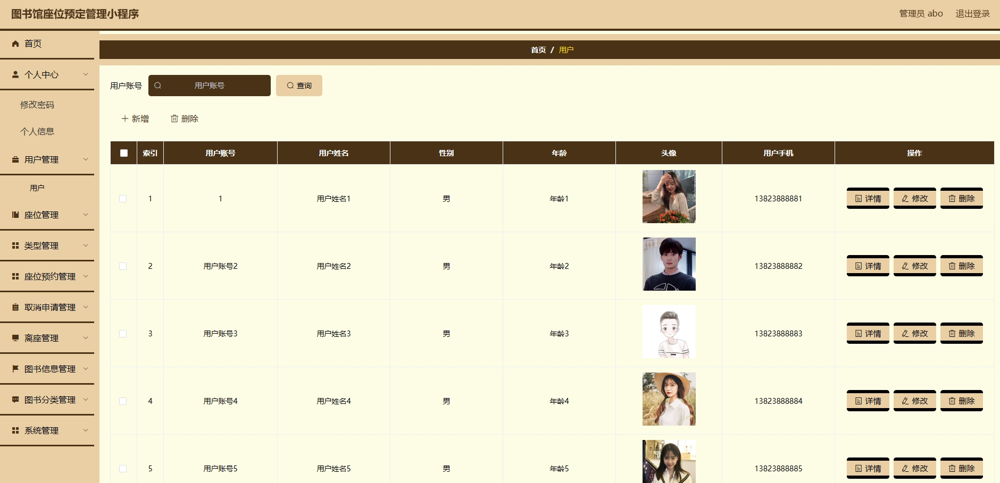
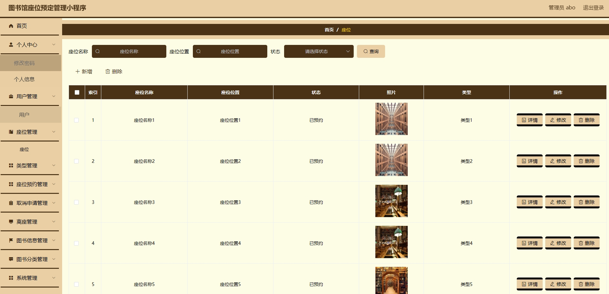
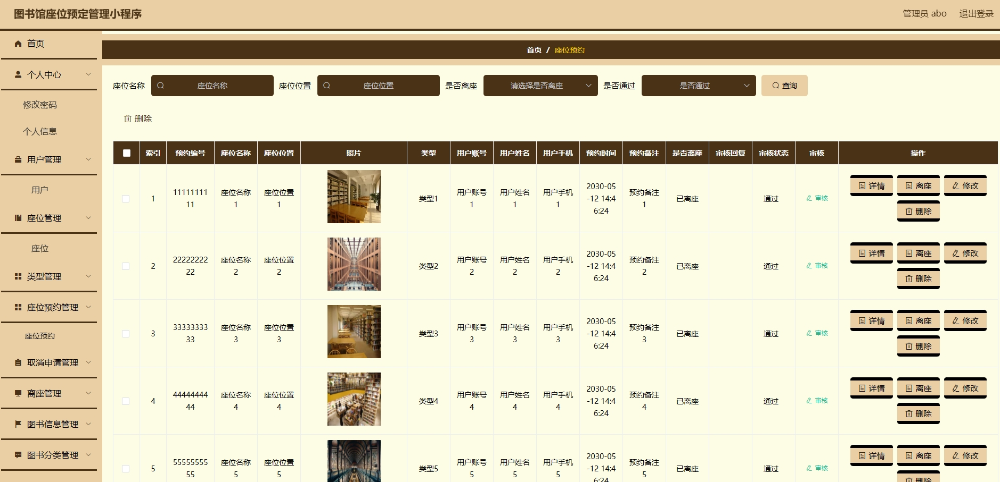
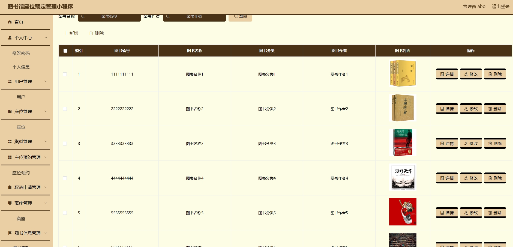
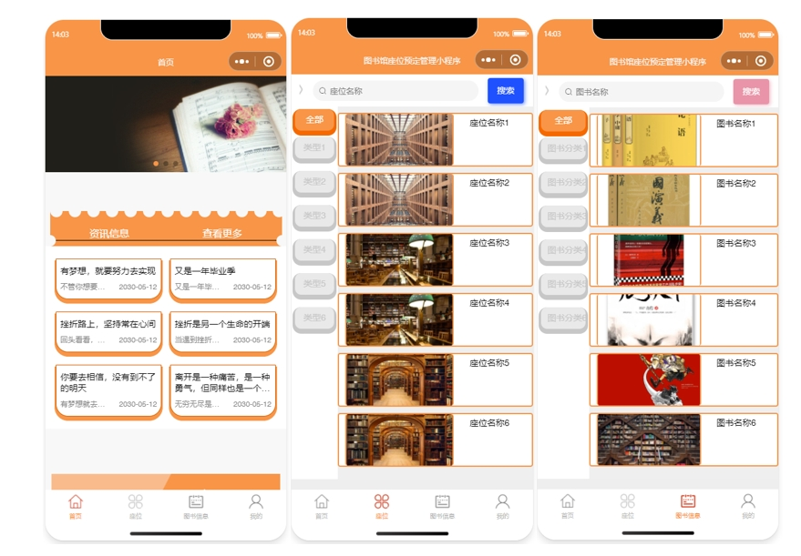
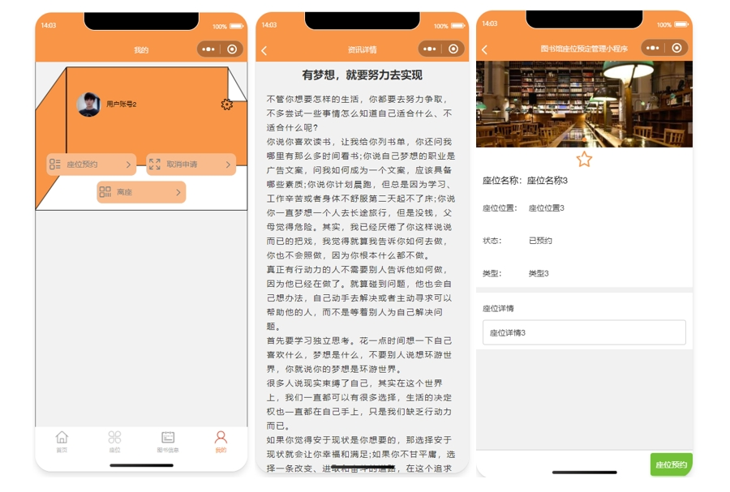
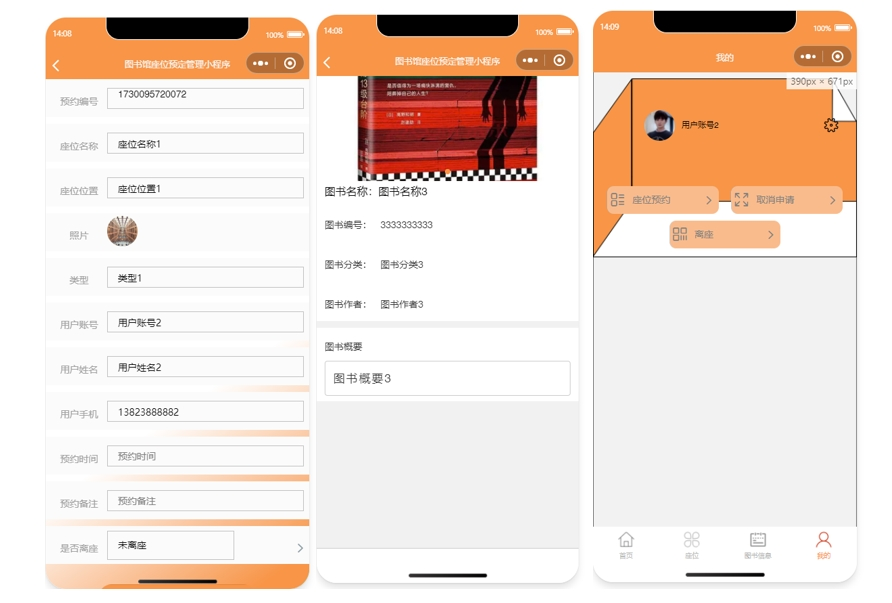
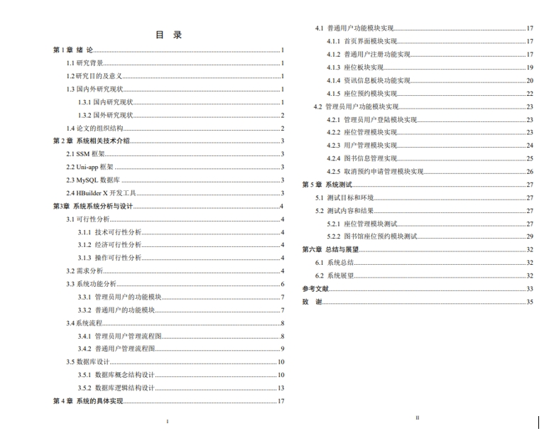

# 1.项目介绍
- 功能模块：用户管理、座位管理、座位预约、图书管理、用户预约申请管理、信息栏等

- 技术栈：SSM ， MySQL5.7+，uniapp，Vue

- 测试环境：idea2024，tomcat8.5，Maven3，MySQL5.7

代码本地亲测，确保运行，运行不起来请先进行自我检查。

# 2.项目部署
## 2.1 后端
- 创建数据库，导入sql
- 通过idea打开后端项目
- 根据本地数据库环境，修改src/main/resources/config.properties  3-5行
- 配置tomcat，其中deployment下的application context 配置为/springboot05ubx（当然，这个随意，前提是你会自己修改，目前小程序端请求的api是这个路径）
- 后端管理web： http://localhost:8080/springboot05ubx/admin/dist/index.html ，账号密码：abo/abo
## 2.2 小程序端
- 通过微信开发工具打开小程序项目
- appid选择测试号即可
- 运行登录（账号自行查看yonghu表）
# 3.项目部分截图

# 4.获取方式
[戳我查看](https://gitee.com/aven999/mall)